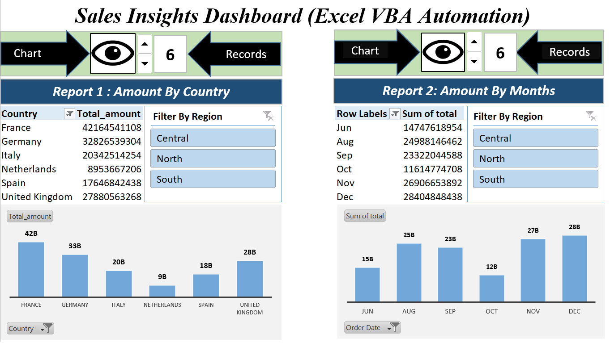

# 📊 Sales Insights Dashboard | Excel VBA Automation 

🚀 An interactive Excel dashboard powered by VBA automation to analyze sales performance across regions and time, enabling data-driven decision making and business insights.

---

## ✨ Key Highlights

-  Real-time sales analysis by country and month  
-  Region-wise filtering (Central, North, South)  
-  Interactive charts & Pivot Tables  
-  VBA-based automation for dynamic reporting  
-  KPI-driven insights for decision making  

---

🚀 This dashboard solves these challenges by providing automated, interactive, and real-time insights.

---

## 🛠️ Tools & Techniques

- Microsoft Excel  
- VBA (Automation)  
- Pivot Tables  
- Data Visualization (Charts)  
- Data Cleaning  

---

## 📥 Access Dashboard

👉 [Download Excel Dashboard](sales-insights-dashboard.xlsm)

---

## 📸 Dashboard Preview

### 🔹 Main Dashboard

  

---

### 🔹 More Views

  
  
  

---

## 💡 Project Impact

This dashboard helps in:

-  Monitoring sales performance across regions  
-  Identifying trends and peak months  
-  Detecting low-performing areas quickly  
-  Supporting data-driven business decisions  

---

## 🎯 Use Cases

- Business performance tracking  
- Sales reporting automation  
- KPI monitoring  
- Decision support for managers  

---

## ⚡ Features in Action

-  Dynamic filtering using slicers  
-  Automated chart updates  
-  VBA-enabled interactivity  
-  Clean and structured data model  

---

## 📊 Business Problem

- Lack of real-time visibility into sales performance  
- Difficulty in analyzing region-wise trends  
- Manual and time-consuming reporting process  

This dashboard solves these challenges using automation, interactive filtering, and data visualization.  

---

## 🔗 Connect with Me

- 💼 LinkedIn: https://linkedin.com/in/saloni-agarwal-7b9484291  
- 📧 Email: agarwalsaloni546@gmail.com  

💼 Actively seeking HR / Human Resource internship opportunities  
Passionate about recruitment, employee engagement, and people analytics
